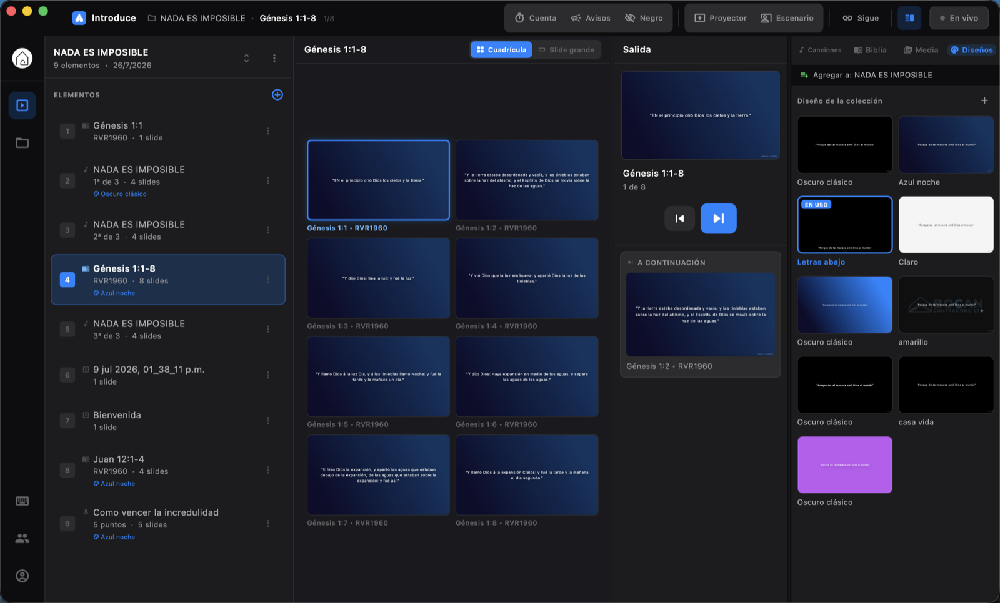
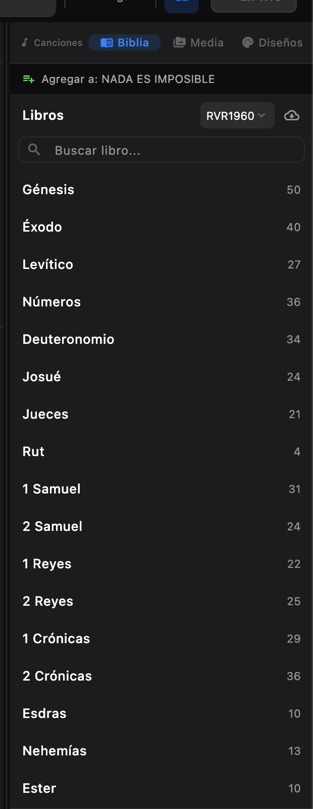
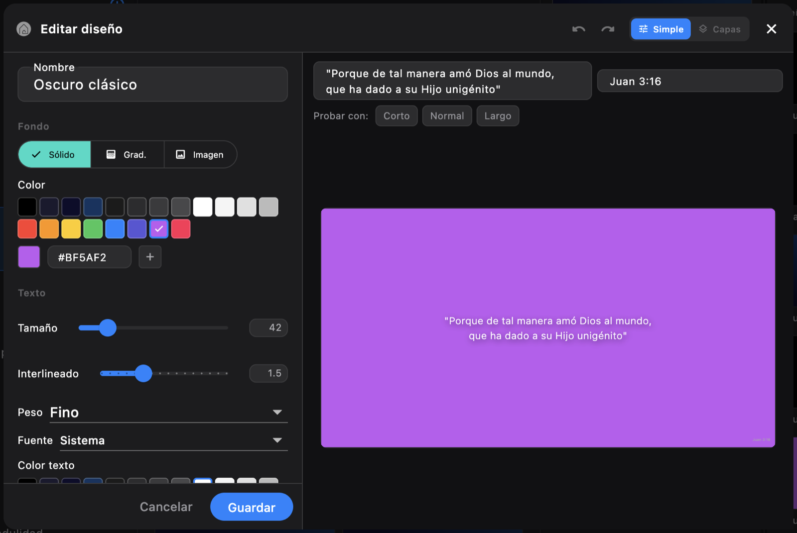
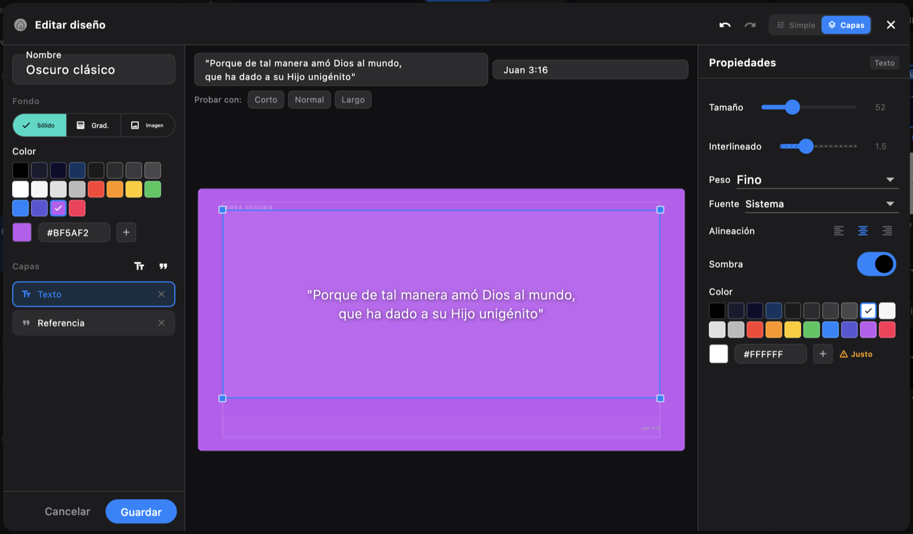
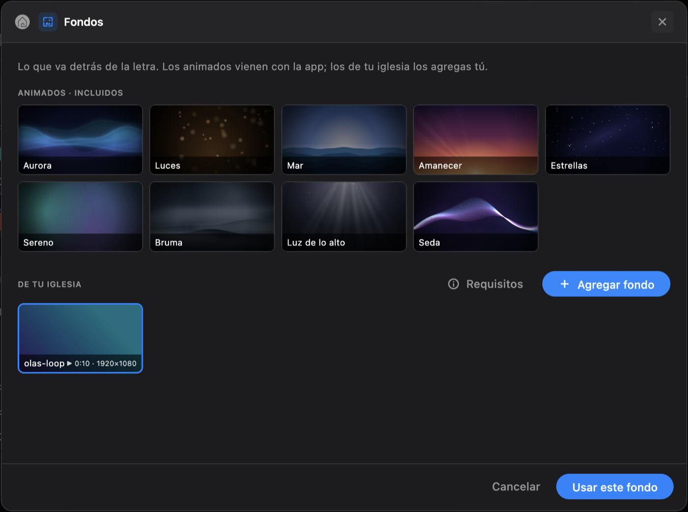
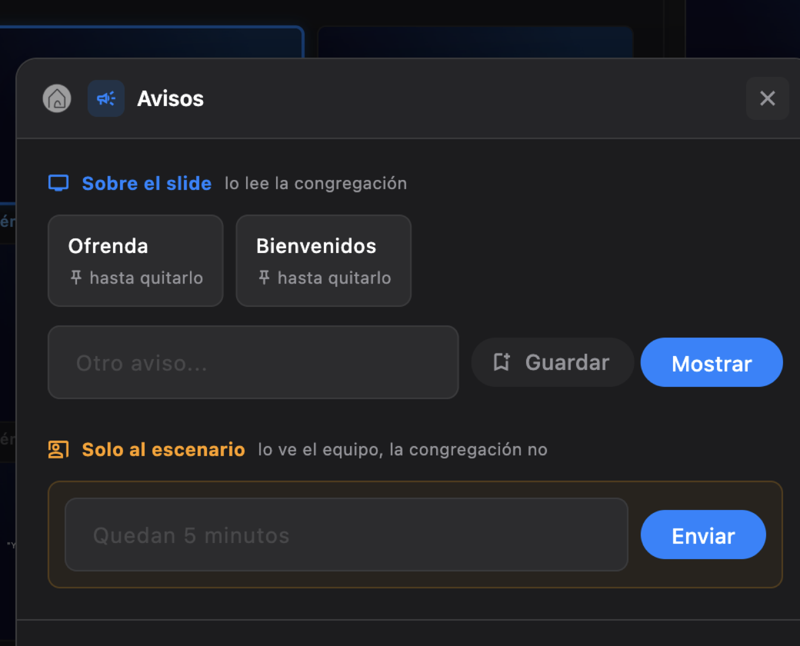
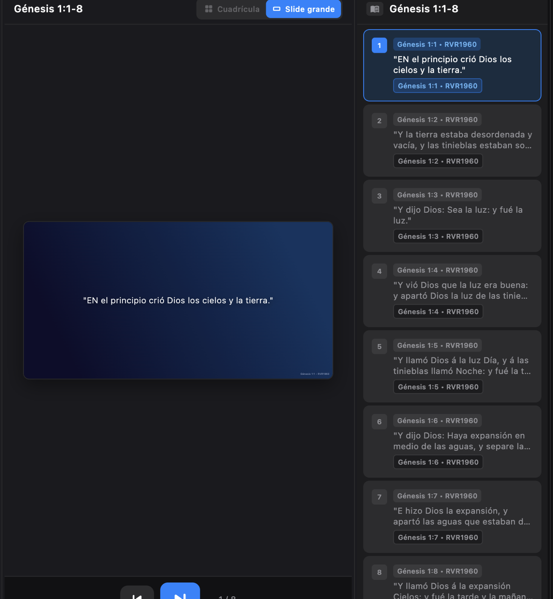

# Introduce

Software de proyección para iglesias de habla hispana. Letras, versículos,
avisos y videos en la pantalla del templo, manejados desde una sola ventana por
la persona que está en la consola un domingo a las ocho de la mañana.

Es una alternativa a ProPresenter pensada para el caso real de la mayoría de
las iglesias: un portátil, un proyector, alguien que aprendió a usarlo hace dos
semanas y una conexión a internet que a veces no está.



---

## Qué hace

**Servicio completo en una lista.** Canciones, pasajes, videos, imágenes y
puntos de la predicación en un solo orden. Se arrastra, se renombra, se
duplica el domingo pasado para armar el siguiente.

**Preview y programa separados.** El cursor se mueve por la lista sin tocar lo
que la congregación está viendo. Se manda a pantalla cuando está listo. El
panel *A continuación* muestra lo que sigue para no navegar a ciegas.

**Trae tu biblioteca de otro programa.** Se elige una carpeta —la biblioteca
entera de ProPresenter, una exportación de OpenLP— o archivos sueltos, y antes
de agregar nada se revisa canción por canción con la letra al lado. Lo que ya
está en la biblioteca (por título o por número CCLI) y las copias repetidas
quedan sin marcar; de varias copias de la misma canción se marca la más
completa. El copyright y el número CCLI vienen con la canción, para el reporte
de licencias.

| Programa | Archivos |
|---|---|
| ProPresenter 7 | `.pro` (con los grupos y el arreglo elegido) |
| ProPresenter 4, 5 y 6 | `.pro4`, `.pro5`, `.pro6` |
| OpenLP y otros con OpenLyrics | `.xml` |
| SongSelect de CCLI | `.usr`, `.bin`, `.txt` |
| ChordPro | `.cho`, `.chordpro`, `.chopro`, `.crd` |
| Texto | `.txt`, una canción por archivo |

**Biblia offline.** Reina-Valera 1960 completa dentro de la app, sin internet.
Búsqueda por libro o escribiendo la referencia directo: `jn 3:16`, `sal 23`.



**Editor de diseños.** Fondo sólido, degradado o foto; tipografía, tamaño,
interlineado, márgenes, sombra, transición. Dos modos: uno simple con
controles, y uno de capas con lienzo, guías e imanes para colocar los bloques a
mano.

<p align="center">
  
  
</p>

- El tamaño del diseño es un techo, no un valor fijo: un salmo largo se achica
  hasta caber en vez de cortarse contra el borde de abajo.
- El editor avisa si el texto no se va a leer desde el fondo del salón, con la
  relación de contraste real. También sobre foto, midiendo la foto por debajo
  de la capa de oscuridad.
- Los colores de la foto se ofrecen como paleta, y la iglesia puede guardar los
  suyos para todos los diseños.
- Deshacer y rehacer con ⌘Z / ⇧⌘Z. Cerrar con cambios pregunta antes.

**Fondos en movimiento.** Nueve escenas animadas vienen con la app, dibujadas
en código: no pesan, no necesitan internet, se ven nítidas en cualquier
proyector y nunca se nota dónde vuelven a empezar. La iglesia puede agregar
las suyas —imágenes o videos en bucle— siempre que cumplan el estándar de
abajo. El fondo sigue corriendo al pasar de un slide a otro: solo cambia la
letra. El primer domingo que se usa un video queda guardado en la computadora,
y desde ahí se reproduce sin internet.



| Estándar de fondos | |
|---|---|
| Forma | Horizontal, 16:9 (o 16:10 para proyectores WXGA) |
| Tamaño | 1920 × 1080 recomendado · mínimo 1280 × 720 · videos hasta 4K |
| Imágenes | JPG, PNG o WebP, hasta 20 MB |
| Videos | MP4, MOV o M4V, hasta 250 MB, de 4 segundos a 3 minutos, sin sonido |

La app revisa el archivo antes de subirlo y dice todo lo que no cumple de una
vez; el servidor vuelve a revisarlo. Consejo para quien los prepara: oscuros y
tranquilos se leen mejor, y un bucle que termina en el mismo cuadro con que
empieza no se nota al reiniciar.

**Pantalla de espera.** Antes del culto y entre partes: una escena animada con
el nombre de la iglesia, un mensaje y la hora o la cuenta regresiva. `W` la
pone y la quita.

**Avisos en medio de la predicación.** Una línea sobre el slide que ve la
congregación, con reloj para que se quite sola, o un mensaje que solo ve el
equipo en la pantalla de escenario. Los avisos que se repiten cada domingo se
guardan y quedan a un clic.



**Pantalla de escenario.** Ventana aparte para el predicador o el músico: lo
que está en pantalla, lo que sigue, y los mensajes del equipo.

**Control desde el teléfono.** Cualquier teléfono en la misma red Wi-Fi pasa
slides, pone en vivo o en negro y salta a otro elemento, viendo lo que está en
pantalla y lo que sigue. No hace falta internet ni instalar nada: la
computadora sirve la página y el teléfono la abre escaneando un QR. Está
apagado hasta que se activa; se empareja con un PIN de seis dígitos (varios
intentos fallidos bloquean esa dirección un minuto), el teléfono queda
recordado para el domingo siguiente, y cambiar el PIN desconecta a todos.

**Salida para la transmisión.** Una ventana aparte con solo la letra sobre un
color plano —verde, azul, magenta o negro— para capturarla en OBS y ponerla
encima de la cámara con un filtro Chroma Key (o Luma Key, con negro). Sigue al
proyector sin internet, pero muestra solo palabras: fotos, videos, la pantalla
de espera o el negro dejan ver la cámara. La letra va abajo o arriba, con barra
oscura sólida o con contorno (sin sombras difusas, que el keyer convierte en un
halo verde), y el tamaño se ajusta con la vista previa en el mismo diálogo.

**Ensayo y tiempos.** Cada elemento del servicio puede tener una duración
planeada. Durante el culto, la salida del operador y la pantalla de escenario
cuentan cuánto lleva el elemento en pantalla contra ese plan: normal, ámbar al
acercarse al final, rojo con cuánto se pasó ("4:42 / 4:00 +0:42"). Los tiempos
no hace falta escribirlos: se ensaya el servicio de corrido, la app cronometra
cada elemento, y al terminar se eligen cuáles guardar como plan. Lo que se
proyecta durante un ensayo no cuenta para el reporte de licencias.

**Modo sin internet.** El servicio arranca y funciona sin red. La sesión
sobrevive, los diseños y la biblioteca de canciones quedan en caché y la app
avisa cuando no alcanza el servidor en vez de quedarse callada. Sin red también
se puede preparar: crear, copiar y borrar servicios, agregar canciones,
pasajes, avisos y videos, quitar elementos (y deshacerlo), reordenar y
renombrar. Todo se ve y se proyecta al instante, queda guardado aunque se
cierre la computadora, y se envía solo, en el orden en que se hizo, cuando
vuelve la conexión. Si en esa computadora entra otra iglesia antes de que
vuelva la red, sus cambios esperan a que la primera vuelva a entrar.

**Vista de slide grande.** Para cuando la cuadrícula estorba y lo único que
importa es lo que está saliendo ahora.



---

## Estado

| Plataforma | Estado |
|---|---|
| macOS | Funcionando, sin firmar todavía |
| Windows | Compila, falta probar en equipo real |
| Linux | Pendiente |
| Control desde el teléfono | Pendiente |

---

## Cómo correrlo

Requiere Flutter (canal stable, Dart 3.11 o superior).

```bash
make deps      # flutter pub get
make run       # abre la app en macOS
make check     # análisis estático + toda la suite de tests
```

Empaquetar para repartir:

```bash
make dist-mac       # dist/Introduce-AAAAMMDD.zip
make dist-windows   # correr esto en una máquina Windows
```

La primera vez en un Mac ajeno hay que abrirla con clic derecho → Abrir,
porque todavía no está firmada con certificado de Apple.

Borrar datos locales y empezar de cero:

```bash
make reset
```

---

## Cómo está armado

Flutter para escritorio, con `flutter_modular` para rutas e inyección y
`flutter_bloc` (Cubit) para el estado. El proyector y la pantalla de escenario
son ventanas aparte, en motores propios, con `desktop_multi_window`.

```
lib/
  core/
    api/            cliente HTTP e interceptores
    local_db/       drift/SQLite: Biblia y caché offline
    models/         colección, elemento, slide, diseño, capa
    repositories/   una por recurso del backend
    services/       preferencias, ventanas, sesión
    theme/          colores, medidas, tipografía
    widgets/        SlideView, editor de diseños, biblioteca de medios
    windows/        canal entre la ventana principal y las secundarias
  modules/
    auth/           entrar y registrarse
    collections/    servicios y su contenido
    presentation/   la consola del operador
    display/        lo que ve la congregación
    stage/          lo que ve el equipo
    songs/          canciones y letras
    templates/      diseños
```

Más detalle en [docs/architecture.md](docs/architecture.md) y
[docs/ui-architecture.md](docs/ui-architecture.md).

El backend es un servicio aparte en Go:
[introduce-api](https://github.com/steven230500/introduce-api).

---

## Tests

```bash
make test
```

La suite cubre los cubits, los modelos, la resolución de referencias bíblicas,
el ajuste de texto, el contraste, las guías del lienzo y el comportamiento de
los diálogos. Los tests describen la situación real que evitan, no el método
que llaman.
